 
## 查看主页获取源码

### 一、作品包含

源码+数据库+设计文档万字+PPT+全套环境和工具资源+部署教程

### 二、项目技术

前端技术：Html、Css、Js、Vue、Element-ui

数据库：MySQL

后端技术：Java、Spring Boot、MyBatis

  

### 三、运行环境

开发工具：IDEA/eclipse

数据库：MySQL5.7

数据库管理工具：Navicat10以上版本

环境配置软件： JDK1.8+Maven3.6.3

前端Nodejs：14

### 四、项目介绍
项目编号：springbootA303

随着人们生活水平的提高和旅游方式的多样化，自驾游已成为越来越受欢迎的出行选择。为了帮助自驾游爱好者规划路线、了解目的地信息以及获取实用的旅行建议，自驾游攻略查询系统的建立显得尤为重要。该系统整合了丰富的旅游资源信息，旨在为用户提供便捷、高效的查询服务，从而提升自驾游体验，推动自驾游市场的健康发展。

前台用户功能：浏览首页、旅游景点、旅游游记、旅游路线、综合资讯、后台管理、个人中心。

后台分为管理员和用户
管理员的功能：系统首页、个人中心、用户管理、景点类型管理、旅游景点管理、旅游游记管理、分类标签管理、旅游路线管理、系统管理。
用户的功能：系统首页、个人中心、旅游游记管理。

### 五、运行截图

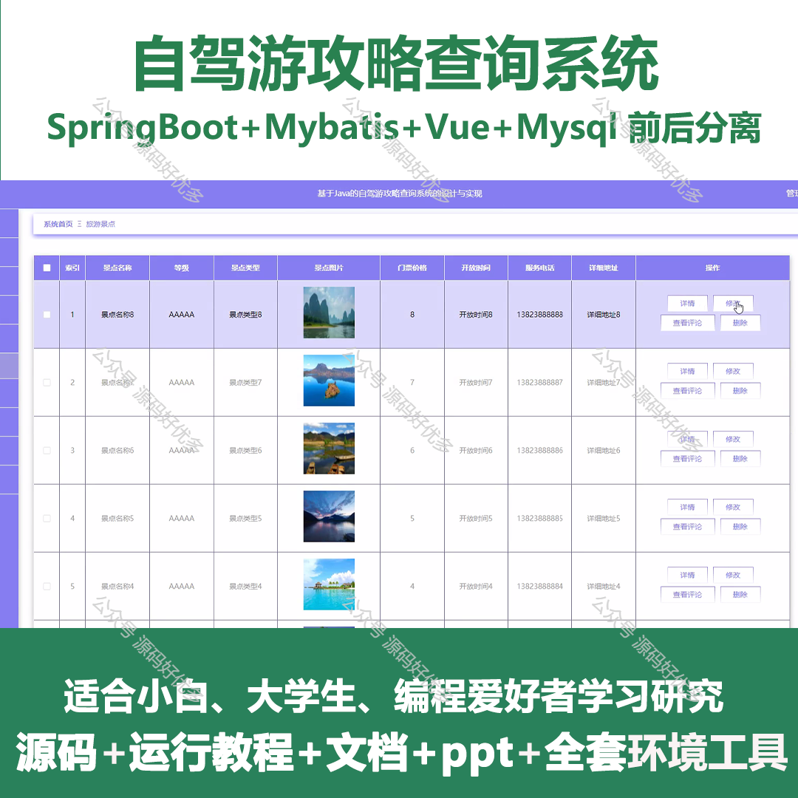
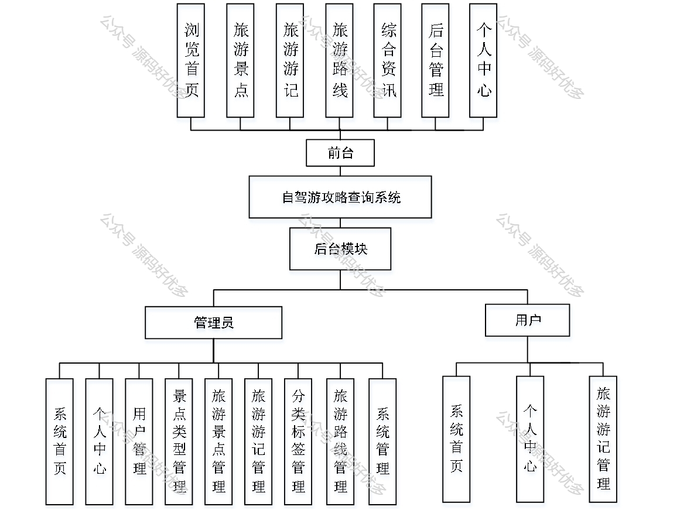
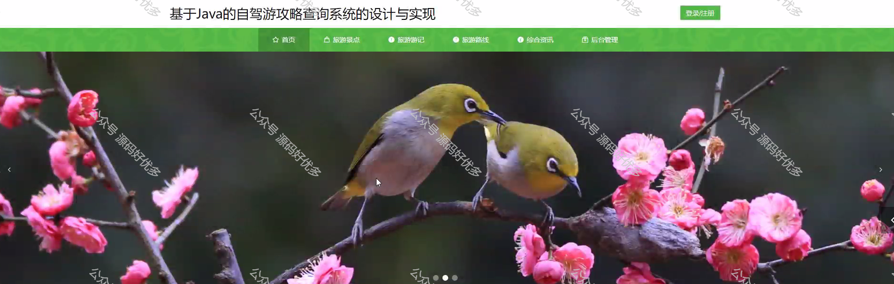
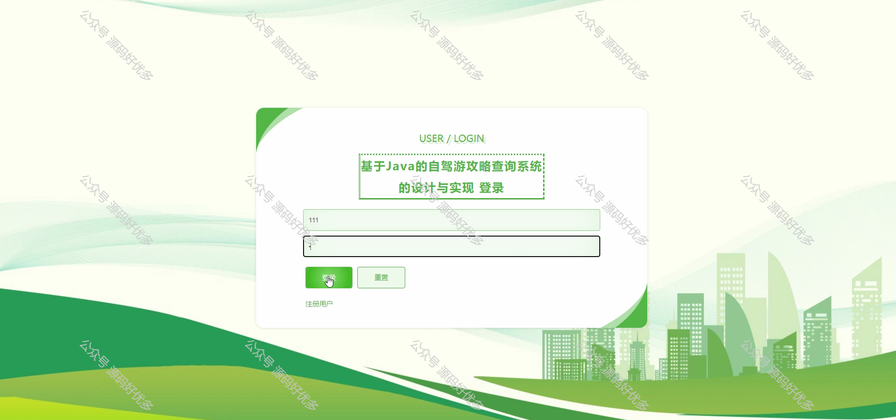
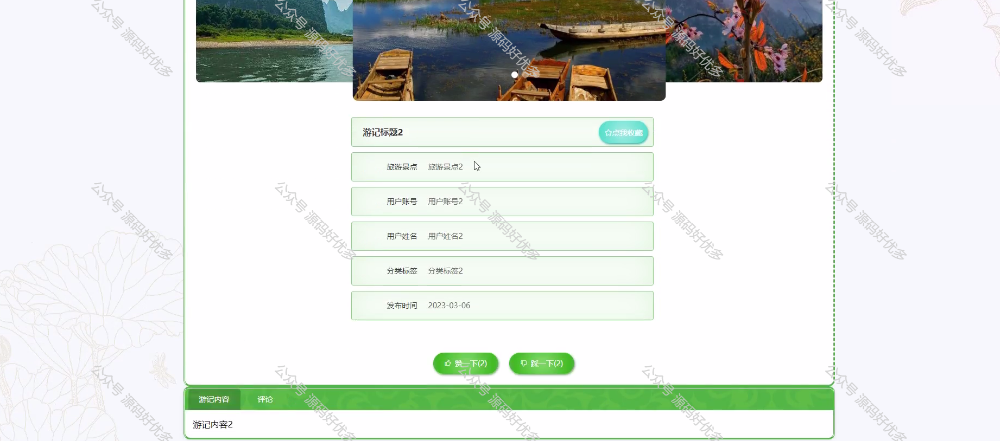
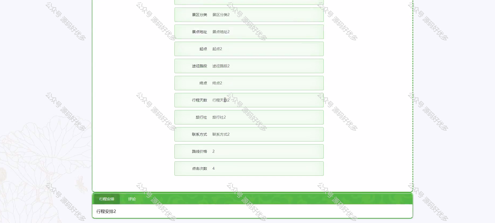
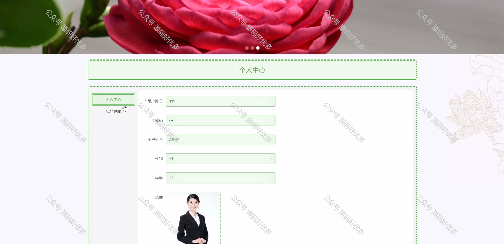
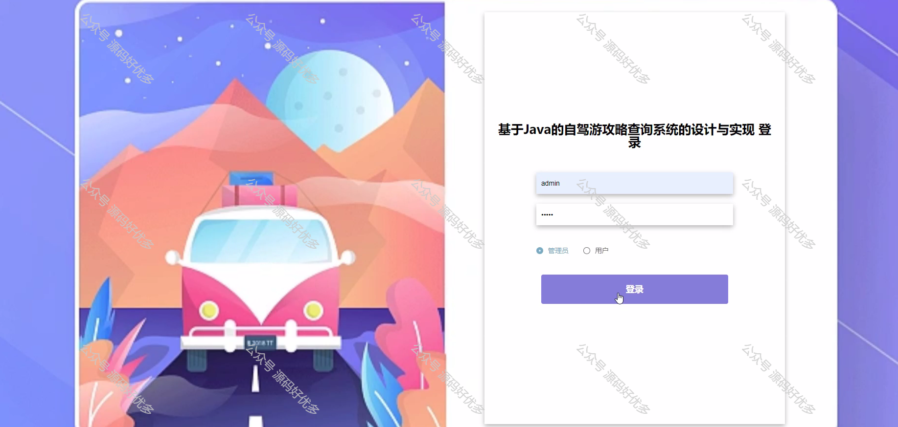
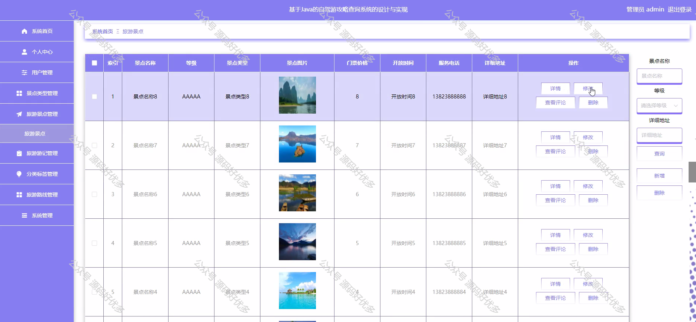
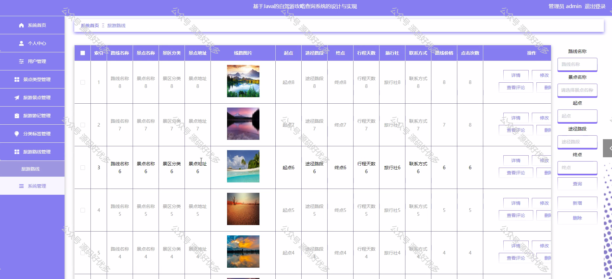
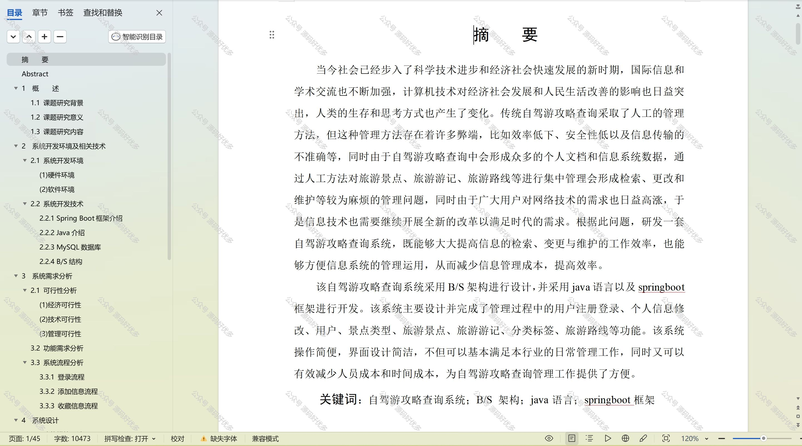

  
